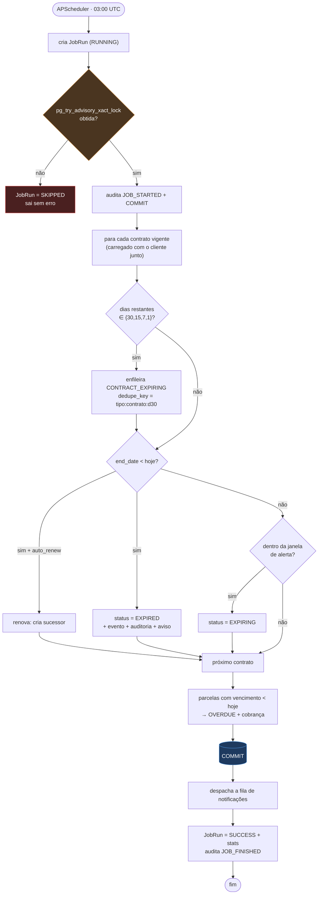
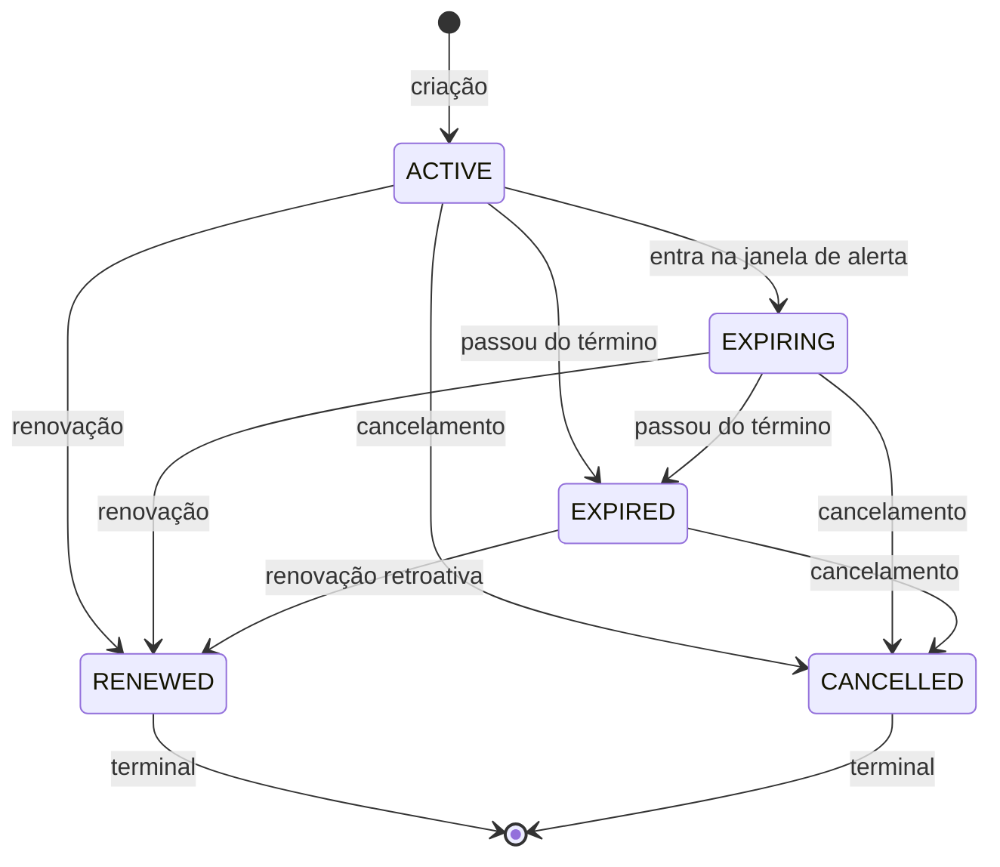

# Automação

Uma rotina diária que varre os contratos vigentes, transiciona status, gera
mensalidades em atraso, enfileira notificações e despacha a fila.

O código está em `app/services/automation_service.py`. O agendador que a dispara
está em `app/jobs/`, e é deliberadamente magro: toda a lógica mora no serviço,
que é testável sem agendador e sem HTTP.

---

## 1. O ciclo



A ordem importa: o despacho é o **último** passo porque os anteriores é que
produzem o que ele envia. Invertido, o alerta gerado hoje só sairia amanhã.

O `COMMIT` antes do despacho também é deliberado: sem ele, uma falha de rede no
envio desfaria as transições de status e as notificações geradas, e o job
reprocessaria tudo no dia seguinte como se nada tivesse acontecido.

---

## 2. Idempotência

**Rodar duas vezes no mesmo dia não gera nada em dobro.**

Isso não é conveniência. É o que permite reprocessar um dia que falhou sem ligar
para o cliente pedindo desculpa pelos e-mails repetidos — e é o que torna seguro
rodar o job manualmente numa demonstração.

A garantia está no **índice do banco**, não na memória do processo:

| Objeto | Restrição |
|---|---|
| Notificação | `UNIQUE (dedupe_key)` |
| Mensalidade | `UNIQUE (contract_id, competence)` |

Os dois usam `INSERT ... ON CONFLICT DO NOTHING`.

### Por que não verificar antes de inserir

"Já existe?" seguido de `INSERT` tem uma janela entre as duas operações. Duas
réplicas passam as duas pela verificação antes de qualquer uma inserir. O banco
não tem essa janela.

### Por que não `try/except IntegrityError`

No PostgreSQL, **a primeira instrução que falha aborta a transação inteira**. O
`except` executa, o fluxo continua, e todo comando seguinte é recusado com
`current transaction is aborted, commands ignored until end of transaction
block`.

O detalhe cruel é que o teste não pega: com **uma** duplicata e nada depois
dela, o fluxo nunca chega ao comando seguinte e tudo parece certo. Quebra em
produção, no segundo item do lote.

### A escolha do marcador da chave

```python
dedupe_key = f"{tipo}:{contract_id}:{marcador}"
```

| Tipo | Marcador | Por quê |
|---|---|---|
| `CONTRACT_EXPIRING` | limiar (`d30`) | Cada limiar dispara **uma vez na vida do contrato**. Com a data de hoje, reprocessar um dia antigo criaria um aviso novo para o mesmo limiar |
| `CONTRACT_EXPIRED` | `end_date` | O vencimento acontece uma única vez |
| `INSTALLMENT_OVERDUE` | competência | Uma cobrança por competência |

### O detalhe que custou um defeito real

Saber se a inserção aconteceu **não** pode se apoiar em `rowcount`. Com
psycopg3, `INSERT ... ON CONFLICT` devolve `rowcount` **-1** ("desconhecido")
tanto na inserção quanto no conflito — e `bool(-1)` é `True`.

O método respondia "inseri" sempre. O banco continuava recusando a duplicata,
então nenhuma notificação repetida era criada, mas o job **relatava** alertas
gerados a cada execução: o número que vai para o painel e para `job_runs` passou
a mentir.

A correção é `RETURNING id` — a resposta vem do próprio comando, sem depender de
como o driver conta. O defeito passou por toda a suíte unitária, porque o dublê
em memória implementava a semântica correta. Só um banco de verdade mostrou a
diferença.

---

## 3. Exclusão mútua

```sql
SELECT pg_try_advisory_xact_lock(<hash de 64 bits do nome da trava>);
```

**`try`, não a versão que espera.** A semântica desejada é "se outra réplica já
está fazendo isso, não faça de novo" — e não "faça de novo daqui a pouco".

**Variante `xact`, não a de sessão.** A trava de transação é liberada
automaticamente no fim da transação, inclusive se o processo morrer.
`pg_advisory_lock` precisaria de unlock explícito, e um `kill -9` no meio do job
deixaria a trava presa até alguém reiniciar o banco: a automação simplesmente
pararia de rodar, em silêncio, para sempre.

A instância que não obtém a trava registra `JobRun` com status `SKIPPED` e sai.
**Não é erro** — é a segunda réplica se comportando corretamente.

A chave numérica vem de um SHA-256 do nome legível, porque o PostgreSQL só
aceita inteiro de 64 bits. O hash é estável entre processos e reinicializações.

---

## 4. Os limiares de alerta

Configuráveis por `EXPIRATION_ALERT_DAYS` (padrão: `30,15,7,1`).

```python
def matched_alert_threshold(end_date, reference, thresholds) -> int | None:
    remaining = (end_date - reference).days
    return remaining if remaining in set(thresholds) else None
```

A comparação é por **igualdade**, não por `<=`.

Com `<=`, um contrato que vence em 20 dias casaria com o limiar de 30 **todo
dia** até vencer — trinta e-mails para o mesmo cliente. Por igualdade, cada
limiar dispara uma vez.

A idempotência da `dedupe_key` é a segunda camada: mesmo que o job rode duas
vezes no dia em que faltam exatamente 30, o segundo insert é recusado.

---

## 5. Transições de status



`CANCELLED` e `RENEWED` são **terminais**: a automação não os toca. Sem essa
guarda, o job da madrugada marcaria como `EXPIRING` um contrato que o cliente
cancelou — e mandaria aviso de renovação para ele.

`EXPIRED → RENEWED` é permitido de propósito: renovação retroativa é decisão
comercial legítima. O que não se permite é renovar o que foi cancelado ou já
renovado, o que geraria dois sucessores.

**Vencido é a partir do dia seguinte ao término.** No próprio dia do término o
contrato ainda vale — é o último dia de vigência. Tratar `end_date == hoje` como
vencido encerra a cobertura do cliente um dia antes da hora, e é o tipo de erro
que só aparece em produção, num único cliente, uma vez por mês.

---

## 6. Mensalidades em atraso

Parcelas com `due_date < hoje` e status `PENDING` ou `OVERDUE` viram `OVERDUE` e
geram cobrança.

`<` e não `<=`: **no próprio dia do vencimento a parcela está no prazo.**
Marcá-la como atrasada às 3h da manhã do dia do vencimento manda cobrança de
inadimplência para quem tem o dia inteiro para pagar.

Contrato cancelado não gera cobrança nova, mesmo com parcela em aberto. Cobrar
ali é o defeito que chega ao cliente como "cancelei e continuam me cobrando".

---

## 7. Renovação automática

Contratos com `auto_renew = true` que passam do término geram o sucessor
automaticamente, usando **exatamente** o mesmo caminho da renovação manual —
`ContractService.renew` — para que histórico e auditoria fiquem idênticos.

Se a renovação de um contrato específico for recusada por regra de negócio
(cliente desativado, por exemplo), o contrato é apenas marcado como vencido e o
job segue. Deixar a exceção subir abortaria a execução inteira por causa de um
registro.

O mesmo princípio vale para cadastro incompleto: contrato cujo cliente não tem
e-mail utilizável é pulado na notificação em vez de derrubar a varredura dos
outros 5.000.

---

## 8. Despacho

`NotificationService.dispatch_pending` consome a fila em ordem **crescente** de
`created_at`.

A ordem importa: com ordem decrescente e um lote menor que a fila, as mais
antigas nunca chegam ao topo — a cada execução entram novas na frente e as
antigas envelhecem para sempre. É inanição de fila, e o sintoma é cruel: o
painel mostra "todas as execuções com sucesso" o tempo inteiro, porque o
indicador acompanhado (taxa de erro) não mede o que importa.

**Uma falha não interrompe o lote.** A próxima notificação é tentada.
Interromper faria um destinatário com e-mail inválido bloquear os avisos de
todos os outros clientes daquela noite.

**Um commit por notificação**, e não um para o lote inteiro.

A primeira versão comitava uma vez no fim, com o argumento de que menos idas ao
banco é melhor. O argumento está errado aqui, e o erro só apareceu com a pilha
inteira de pé: cada envio faz uma chamada HTTP que pode levar segundos, e com o
commit no fim **a transação fica aberta e ociosa durante toda a rede**. Com 20
notificações e um provedor lento, passa de um minuto.

O PostgreSQL derruba essa conexão — é para isso que serve o
`idle_in_transaction_session_timeout` de 30 s. O sintoma foi
`server closed the connection unexpectedly` num INSERT de auditoria com 51
linhas: uma mensagem que parece problema de rede, e é problema de desenho.

Manter transação aberta sobre E/S de rede é o defeito; o timeout foi o que o
revelou, e por isso ele fica. Com o commit por item, cada transação dura o tempo
de um UPDATE e um INSERT, e o progresso fica gravado mesmo se o processo morrer
no meio — que é melhor que perder o lote inteiro.

O tratamento de falha do provedor (timeout, retry, disjuntor) está descrito no
[README](../README.md#integração-com-serviço-externo) e implementado em
`app/infrastructure/gateways/http_notifier.py`.

---

## 9. Registro da execução

Toda execução grava uma linha em `job_runs`:

```json
{
  "status": "SUCCESS",
  "started_at": "2026-09-17T03:00:00Z",
  "finished_at": "2026-09-17T03:00:04Z",
  "stats": {
    "referencia": "2026-09-17",
    "contratos_analisados": 1284,
    "alertas_gerados": 17,
    "contratos_marcados_a_vencer": 9,
    "contratos_expirados": 3,
    "renovacoes_automaticas": 2,
    "parcelas_atrasadas": 41,
    "cobrancas_geradas": 38,
    "envio": { "processadas": 55, "enviadas": 53, "falhas": 2, "descartadas": 0 }
  }
}
```

Sem esta tabela, "o job rodou hoje?" não tem resposta: a única evidência seria o
log, que expira e que ninguém consulta até o cliente reclamar de um aviso que
não chegou.

A automação também é **auditada**, com autor explícito:
`system:verificacao-diaria-contratos`. Deixar o autor nulo encheria a trilha de
linhas sem responsável, e ninguém saberia distinguir "o sistema expirou" de
"faltou registrar quem expirou".

Consultas:

```bash
curl -H "Authorization: Bearer $TOKEN" http://localhost:8000/api/v1/jobs/runs
```

---

## 10. Execução manual

```bash
# pela API (somente ADMIN)
curl -X POST http://localhost:8000/api/v1/jobs/daily-check/run \
  -H "Authorization: Bearer $TOKEN" -H "Content-Type: application/json" -d '{}'

# reprocessando um dia específico
curl -X POST http://localhost:8000/api/v1/jobs/daily-check/run \
  -H "Authorization: Bearer $TOKEN" -H "Content-Type: application/json" \
  -d '{"reference": "2026-09-16"}'

# pela linha de comando
python -m app.cli rodar-job
python -m app.cli rodar-job --data 2026-09-16
```

A rota é restrita ao ADMIN porque **envia mensagem de verdade para cliente de
verdade**.

---

## 11. Configuração do agendador

| Ajuste | Valor | Por quê |
|---|---|---|
| `coalesce` | `True` | Se o processo ficar suspenso e três disparos vencerem, executa **uma** vez |
| `misfire_grace_time` | 3600 s | Execução atrasada além disso é descartada — um job das 3h disparando às 11h mandaria e-mail em horário comercial |
| `max_instances` | 1 | Impede sobreposição dentro do mesmo processo, que a trava do banco não cobre (ela é entre transações) |
| Fuso | UTC | Sem ambiguidade de horário de verão |

No encerramento, `shutdown(wait=False)`: não segura o desligamento esperando um
job que pode levar minutos. A execução interrompida não deixa estado
inconsistente, porque cada passo é transacional e o job é idempotente — na
próxima execução ele refaz o que ficou pendente, e nada em dobro.
